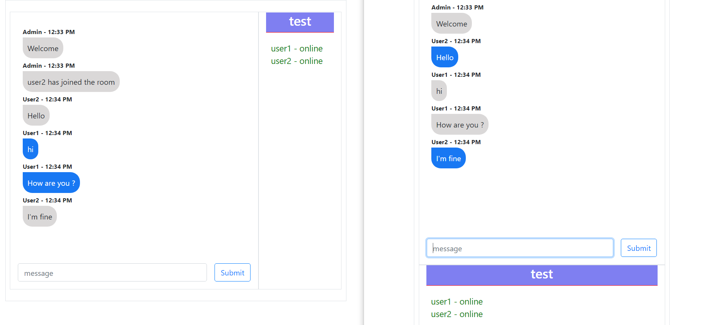

# NodeJs & Socket Chat App

Real time room based chat app using nodejs, socketio

---

### Setup project locally

- `git clone https://github.com/sagar608/socket-chat-app.git`
- cd socket-chat-app
- `npm install`
- `npm run dev`
  > The project will start on localhost:3000

---

### Screenshots

